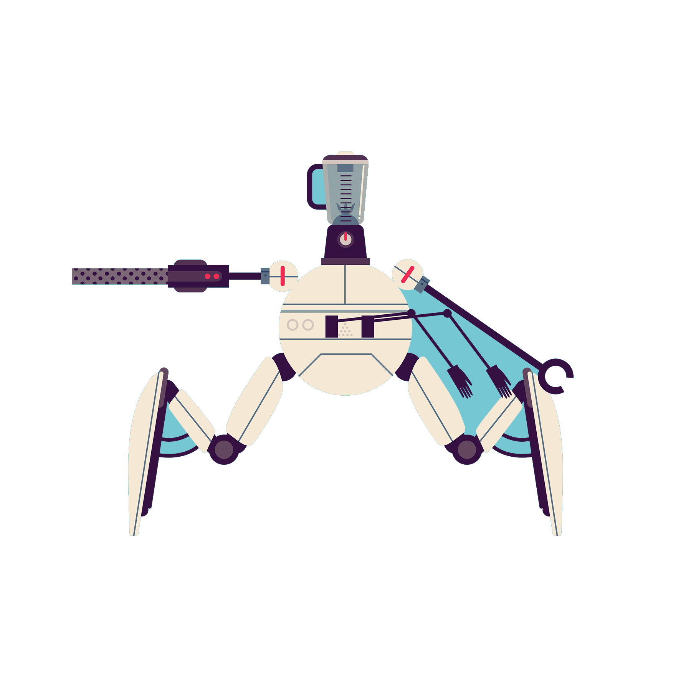
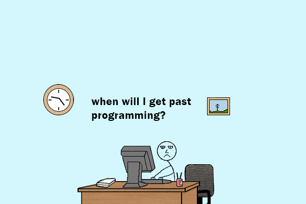
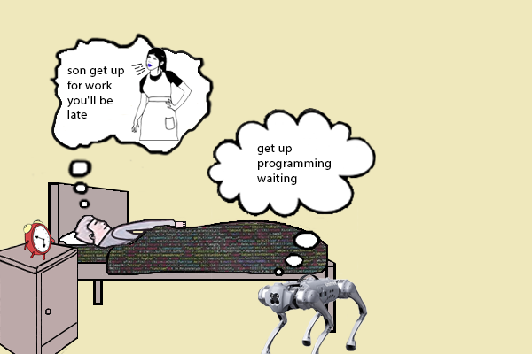

<p align="center">
  <a href="https://inputstudios.ru">
    
  </a>
</p>


<h3 align="center">Interested in programming since 1998, improving my programming skills in C, JavaScript, PHP and various technology stacks such as MERN and LAMP for developing E-Commerce applications and web services. A few years ago, I became interested in Unreal Engine and technologies for the production of computer games and VR content.</h3>





<p align="center"> 
  <b>Profile Views</b><br>
  
</p>

<h2 align="center"> Keen on programming and robotics! </h2><br>


- 👨‍💻 I’m currently working on **Quantum Engine** <br><br><br>

- 👨‍🎓 I’m currently learning **React & Node.js** <br><br><br>

- 💬 Ask me about **Android, MERN, LAMP** <br><br><br>

- 📫 How to reach me **jarekismail@gmail.com** <br><br><br>

- ⚡ Fun fact **The shrimp is the noisiest inhabitant of the ocean.** <br><br><br>

- :octocat: Hobbies: **Reading, Motocross, Cycling, Growing cacti** <br><br><br>

<br><br>

<div align="center">
	


 
  <h2> <strong> 📚 Education </strong>  </h2><br>
  
  
  
  
  
  
  
</div></br>

<div align="center">
  <br>
</div>
<br><br>

<div align="center">
	


  <h2> <strong> ⚙️ Technologies and Skills </strong></h2>
  
  

<h3> <strong> Languages, Frameworks, and Tools </strong></h3>
  <p align="center"> 
   <a href="https://www.cprogramming.com/" target="_blank" rel="noreferrer">  </a> <a href="https://www.w3schools.com/cpp/" target="_blank" rel="noreferrer">  </a> 
   <a href="https://www.python.org/" target="_blank" rel="noreferrer">  </a> 
   <a href="https://www.java.com" target="_blank" rel="noreferrer">  </a> 
   <a href="https://developer.mozilla.org/en-US/docs/Web/JavaScript" target="_blank" rel="noreferrer">  </a>
   <a href="https://www.w3.org/html/" target="_blank" rel="noreferrer">  </a>
   <a href="https://developer.mozilla.org/en-US/docs/Web/CSS" target="_blank" rel="noreferrer">  </a>
    <a href="https://www.php.net" target="_blank" rel="noreferrer">  </a>
    <a href="https://sass-lang.com" target="_blank" rel="noreferrer">  </a>
    <a href="https://webpack.js.org" target="_blank" rel="noreferrer">  </a>
    <a href="https://getbootstrap.com" target="_blank" rel="noreferrer">  </a>
    <a href="https://nodejs.org" target="_blank" rel="noreferrer">  </a>
    <a href="https://www.mysql.com/" target="_blank" rel="noreferrer">  </a>
    <a href="https://firebase.google.com/" target="_blank" rel="noreferrer">  </a> <br>
    <a href="https://www.mongodb.com" target="_blank" rel="noreferrer">  </a> 
    <a href="https://mariadb.org/" target="_blank" rel="noreferrer">  </a> 
    <a href="https://symfony.com" target="_blank" rel="noreferrer">  </a>
    <a href="https://postman.com" target="_blank" rel="noreferrer">  </a>
    <a href="https://laravel.com/" target="_blank" rel="noreferrer">  </a> 
    <a href="https://webpack.js.org" target="_blank" rel="noreferrer">  </a> 
    <a href="https://developer.android.com" target="_blank" rel="noreferrer">  </a>
    <a href="https://dart.dev" target="_blank" rel="noreferrer">  </a>
    <a href="https://flutter.dev" target="_blank" rel="noreferrer">  </a>
    <a href="https://expressjs.com" target="_blank" rel="noreferrer">  </a>
    <a href="https://gradle.org" target="_blank" rel="noreferrer">  </a>
    <a href="https://kotlinlang.org" target="_blank" rel="noreferrer">  </a>
    <a href="https://git-scm.com/" target="_blank" rel="noreferrer">  </a>
    <a href="https://www.linux.org/" target="_blank" rel="noreferrer">  </a> <br>
    <a href="https://www.arduino.cc" target="_blank" rel="noreferrer">  </a> 
    <a href="https://code.visualstudio.com" target="_blank" rel="noreferrer">  </a> 
    <a href="https://gulpjs.com" target="_blank" rel="noreferrer">  </a> 
    <a href="https://unrealengine.com/" target="_blank" rel="noreferrer">  </a>
    <a href="https://www.figma.com" target="_blank" rel="noreferrer">  </a> 
    <a href="https://www.photoshop.com/en" target="_blank" rel="noreferrer">  </a>
    <a href="https://zapier.com" target="_blank" rel="noreferrer">  </a> 
<h3> <strong> Actively Learning </strong></h3>
    <a href="https://reactjs.org/" target="_blank" rel="noreferrer">  </a>
    <a href="https://redux.js.org" target="_blank" rel="noreferrer">  </a>
    <a href="https://www.typescriptlang.org" target="_blank" rel="noreferrer">  </a>
    <a href="https://www.mongodb.com" target="_blank" rel="noreferrer">  </a>
    <a href="https://nextjs.org" target="_blank" rel="noreferrer">  </a>
    <a href="https://firebase.google.com/" target="_blank" rel="noreferrer">  </a> <br>
    <h3> <strong> Planning to Learn </strong></h3>
    <a href="https://angular.io" target="_blank" rel="noreferrer">  </a>
    <a href="https://getbootstrap.com" target="_blank" rel="noreferrer">  </a>
    <a href="https://dotnet.microsoft.com/en-us" target="_blank" rel="noreferrer">  </a>
    <a href="https://expressjs.com" target="_blank" rel="noreferrer">  </a>
    <a href="https://kotlinlang.org" target="_blank" rel="noreferrer">  </a>
    <a href="https://www.linux.org/" target="_blank" rel="noreferrer">  </a><br><br><br>

<div align="center">
	


 
  <h2> <strong> 🏆 My Github Stats </strong> </h2>
  
   <br><br>
  
  
</div> <br>

GitHub Contributions

[](https://github.com/inputstudios/github-readme-activity-graph)<br>

<picture>
  <source media="(prefers-color-scheme: dark)" srcset="https://raw.githubusercontent.com/dreamerenigma/dreamerenigma/output/github-contribution-grid-snake-dark.svg">
  <source media="(prefers-color-scheme: light)" srcset="https://raw.githubusercontent.com/dreamerenigma/dreamerenigma/output/github-contribution-grid-snake.svg">
  
</picture>

<br><br>
WakaTime
<!--START_SECTION:waka-->

```txt
From: 16 September 2022 - To: 13 September 2025

Total Time: 4,200 hrs 34 mins

Dart                   2,030 hrs 16 mins████████████▒▒▒▒▒▒▒▒▒▒▒▒▒   48.33 %
JavaScript             557 hrs 25 mins ███▓▒▒▒▒▒▒▒▒▒▒▒▒▒▒▒▒▒▒▒▒▒   13.27 %
Kotlin                 425 hrs         ██▓▒▒▒▒▒▒▒▒▒▒▒▒▒▒▒▒▒▒▒▒▒▒   10.12 %
XML                    356 hrs 24 mins ██▒▒▒▒▒▒▒▒▒▒▒▒▒▒▒▒▒▒▒▒▒▒▒   08.48 %
C++                    110 hrs 16 mins ▓▒▒▒▒▒▒▒▒▒▒▒▒▒▒▒▒▒▒▒▒▒▒▒▒   02.63 %
```

<!--END_SECTION:waka-->

<br><br>
Mems
<p float="left">
   
   
</p>

<br><br>

<div align="center">
	


	
  <h2 align="center"> 💼 Projects </h2>
  
  <a href="https://github.com/dreamerenigma/UE4-CPP-Shooter-Series" target="_blank">
    
  </a>
  <a href="https://github.com/dreamerenigma/dreamerenigma" target="_blank">
    
  </a>
</div>

<br><br>

<div align="center">
	
 
 
 
<h2> <strong> 📹 Video, Contacts and Support</strong></h2><br>
<h3 align="left">Latest YouTube video:</h3>
<h3 align="left">   
  
<!-- YOUTUBE:START -->
- [Bird Song Forest](https://www.youtube.com/watch?v=BzMp7il9LNI)
- [Castle Princess Game](https://www.youtube.com/watch?v=YWIhFmDf-ic)
- [Matrix: Awakens - Small City gameplay use tools Houdini, SpeedTree, Unreal Engine 5](https://www.youtube.com/watch?v=wsvcdTs767Q)
- [FPS Shooter game mechanics](https://www.youtube.com/watch?v=1Nx9vyO44EI)
- [Branch under the sun - SpeedTree](https://www.youtube.com/watch?v=VtXYPEkF1MI)
<!-- YOUTUBE:END -->
</h3>
</div>

<h3 align="left">Connect with me:</h3>
<p align="left">
<a href="https://codepen.io/inputstudios" target="blank"></a>
<a href="https://twitter.com/andrey_trepalin" target="blank"></a>
<a href="https://linkedin.com/in/andrey-trepalin-a795561b4" target="blank"></a>
<a href="https://stackoverflow.com/users/15381038" target="blank"></a>
<a href="https://www.facebook.com/r3duct" target="blank"></a>
<a href="https://dribbble.com/inputstudios" target="blank"></a>
<a href="https://www.youtube.com/channel/UC-LXe9myi8QXh2M5UYNl1oQ" target="blank"></a>
<a href="https://discord.gg/tgg89x4HXr" target="blank"></a>
</p>

<h3 align="left">Support:</h3>
<p><a href="https://www.buymeacoffee.com/inputstudios"> </a>
<a href="https://ko-fi.com/inputstudios"> </a></p>
